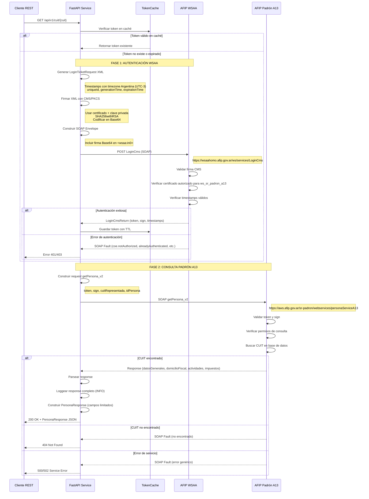

# Flujo de Conexión AFIP - Documentación Completa

## Índice

1. [Diagrama de Secuencia](#diagrama-de-secuencia)
2. [Fase 1: Autenticación WSAA (LoginCms)](#fase-1-autenticación-wsaa-logincms)
3. [Fase 2: Consulta Padrón A13 (getPersona_v2)](#fase-2-consulta-padrón-a13-getpersona_v2)
4. [Ejemplos de Requests y Responses](#ejemplos-de-requests-y-responses)
5. [Análisis de la Implementación](#análisis-de-la-implementación)
6. [Posibles Problemas y Soluciones](#posibles-problemas-y-soluciones)

---

## Diagrama de Secuencia



---

## Fase 1: Autenticación WSAA (LoginCms)

### Paso 1: Generar LoginTicketRequest XML

**Ubicación:** `app/utils/xml_utils.py:build_login_ticket_request()`

**Proceso:**
1. Obtener timestamp actual en timezone Argentina (UTC-3)
2. Calcular timestamp de expiración (máximo 24 horas)
3. Generar `uniqueId` (Unix timestamp)
4. Construir XML sin declaración XML

**XML Generado:**
```xml
<loginTicketRequest version="1.0">
  <header>
    <uniqueId>1710426600</uniqueId>
    <generationTime>2024-03-14T10:30:00-03:00</generationTime>
    <expirationTime>2024-03-15T10:30:00-03:00</expirationTime>
  </header>
  <service>ws_sr_padron_a13</service>
</loginTicketRequest>
```

**Puntos críticos:**
- ✅ **Timezone obligatorio**: Formato `-03:00` (no `-0300`)
- ✅ **Sin milisegundos**: `HH:MM:SS` (no `HH:MM:SS.000`)
- ✅ **Expiración <= 24 horas**: AFIP rechaza períodos mayores
- ✅ **Sin declaración XML**: El XML a firmar NO debe incluir `<?xml version="1.0"?>`

---

### Paso 2: Firmar con CMS/PKCS#7

**Ubicación:** `app/utils/crypto_utils.py:sign_and_encode()`

**Proceso:**
1. Cargar certificado X.509 (`.crt`)
2. Cargar clave privada RSA (`.key`)
3. Crear firma CMS/PKCS#7 con SHA256withRSA
4. Codificar en Base64

**Código:**
```python
# Cargar certificado y clave
certificate = load_certificate(cert_path)  # x509.Certificate
private_key = load_private_key(key_path, passphrase)  # RSAPrivateKey

# Firmar con CMS/PKCS#7
builder = (
    pkcs7.PKCS7SignatureBuilder()
    .set_data(xml_data.encode('utf-8'))
    .add_signer(certificate, private_key, hashes.SHA256())
)

cms_signature = builder.sign(
    serialization.Encoding.DER,
    [pkcs7.PKCS7Options.Binary]
)

# Codificar en Base64
signature_b64 = base64.b64encode(cms_signature).decode('utf-8')
```

**Salida:**
```
MIIHfgYJKoZIhvcNAQcCoIIHbzCCB2sCAQExDzANBglghkgBZQMEAgEFADALBgkqhkiG9w0BBwGgggU...
(~2000-3000 caracteres Base64)
```

**Puntos críticos:**
- ✅ **Algoritmo SHA256**: No SHA1 (obsoleto)
- ✅ **Encoding DER**: No PEM
- ✅ **PKCS7Options.Binary**: Incluir contenido en la firma
- ✅ **Base64 sin saltos de línea**: String continuo

---

### Paso 3: Construir SOAP Envelope

**Ubicación:** `app/utils/xml_utils.py:build_wsaa_soap_envelope()`

**SOAP Request:**
```xml
<?xml version="1.0" encoding="UTF-8"?>
<soapenv:Envelope xmlns:soapenv="http://schemas.xmlsoap.org/soap/envelope/" 
                  xmlns:wsaa="http://wsaa.view.sua.dvadac.desein.afip.gov">
    <soapenv:Header/>
    <soapenv:Body>
        <wsaa:loginCms>
            <wsaa:in0>MIIHfgYJKoZIhvcNAQcCoIIHbzCCB2sCAQExDzANBglghkgBZQMEAgEFADALBgkq...</wsaa:in0>
        </wsaa:loginCms>
    </soapenv:Body>
</soapenv:Envelope>
```

**Headers HTTP:**
```
POST /ws/services/LoginCms
Host: wsaahomo.afip.gov.ar
Content-Type: text/xml; charset=utf-8
SOAPAction: 
```

---

### Paso 4: Enviar Request a WSAA

**Ubicación:** `app/connectors/wsaa_connector.py:_send_login_cms_request()`

**Código:**
```python
headers = {
    "Content-Type": "text/xml; charset=utf-8",
    "SOAPAction": ""  # WSAA no requiere SOAPAction específico
}

async with httpx.AsyncClient(timeout=30.0) as client:
    response = await client.post(
        self.wsaa_url,  # https://wsaahomo.afip.gov.ar/ws/services/LoginCms
        content=soap_request.encode('utf-8'),
        headers=headers
    )
```

---

### Paso 5: Parsear Response (LoginCmsReturn)

**Response exitoso:**
```xml
<?xml version="1.0" encoding="UTF-8"?>
<soapenv:Envelope xmlns:soapenv="http://schemas.xmlsoap.org/soap/envelope/">
    <soapenv:Body>
        <loginCmsReturn>
            <token>PD94bWwgdmVyc2lvbj0iMS4wIiBlbmNvZGluZz0iVVRGLTgiIHN0YW5kYWxvbmU9InllcyI/Pgo...</token>
            <sign>hZ8fQ2Vr3K9lN4pXwY6tU7mJ5nR8sO2vA1bC9dE6fG3hI4jK5lM6nO7pQ8rS9tU0vW1xY2zA...</sign>
            <generationTime>2024-03-14T10:30:00.000-03:00</generationTime>
            <expirationTime>2024-03-14T22:30:00.000-03:00</expirationTime>
        </loginCmsReturn>
    </soapenv:Body>
</soapenv:Envelope>
```

**Código de parseo:**
```python
# app/utils/xml_utils.py:parse_login_cms_response()

root = ET.fromstring(xml_response)
login_return = root.find('.//{*}loginCmsReturn')

token = login_return.findtext('token')
sign = login_return.findtext('sign')
generation_time_str = login_return.findtext('generationTime')
expiration_time_str = login_return.findtext('expirationTime')

token_data = TokenData(
    token=token,
    sign=sign,
    generation_time=parse_afip_timestamp(generation_time_str),
    expiration_time=parse_afip_timestamp(expiration_time_str)
)
```

---

### Errores Comunes en WSAA

#### Error 1: `coe.notAuthorized`
```xml
<soapenv:Fault>
    <faultcode>ns1:coe.notAuthorized</faultcode>
    <faultstring>Computador no autorizado para el servicio solicitado</faultstring>
</soapenv:Fault>
```

**Causa:** El certificado NO está asociado al servicio `ws_sr_padron_a13` en el portal de AFIP.

**Solución:**
1. Ir a https://auth.afip.gob.ar/contribuyente_/acceso.xhtml
2. Administrador de Relaciones de Clave Fiscal > Alta de Relación
3. Buscar `ws_sr_padron_a13` y asociar certificado

---

#### Error 2: `coe.alreadyAuthenticated`
```xml
<soapenv:Fault>
    <faultcode>ns1:coe.alreadyAuthenticated</faultcode>
    <faultstring>El CEE ya posee un TA valido para el acceso al WSN solicitado</faultstring>
</soapenv:Fault>
```

**Causa:** AFIP ya emitió un token válido para este certificado y no permite generar uno nuevo hasta que expire (~12 horas).

**Solución:**
1. Esperar 5-10 minutos para que AFIP detecte la expiración
2. Verificar que el sistema de caché local esté funcionando correctamente
3. Si persiste, el certificado puede estar siendo usado por otro sistema/proceso

**NOTA IMPORTANTE:** Este error puede **enmascarar** un error `coe.notAuthorized` subyacente. Si el certificado no está asociado al servicio, AFIP igualmente retorna `alreadyAuthenticated` si existe un token previo.

---

#### Error 3: `expirationTime.invalid`
```xml
<soapenv:Fault>
    <faultcode>ns1:expirationTime.invalid</faultcode>
    <faultstring>El valor del campo expirationTime es invalido</faultstring>
</soapenv:Fault>
```

**Causa:**
- Expiración configurada en más de 24 horas
- Formato de timestamp incorrecto (falta timezone)
- Reloj del sistema desincronizado

**Solución:**
- Verificar formato: `2024-03-14T10:30:00-03:00` (con timezone)
- Verificar expiración <= 24 horas
- Sincronizar reloj del sistema

---

## Fase 2: Consulta Padrón A13 (getPersona_v2)

### Paso 1: Preparar Request

**Ubicación:** `app/connectors/padron_connector.py:get_persona_by_cuit()`

**Parámetros del método `getPersona_v2`:**
```python
request_params = {
    "token": token_data.token,        # Token obtenido de WSAA
    "sign": token_data.sign,          # Sign obtenido de WSAA
    "cuitRepresentada": "20351798239", # CUIT del certificado (quien consulta)
    "idPersona": "20351798239"        # CUIT a consultar (autoconsulta)
}
```

**Diferencias A10 vs A13:**
| Parámetro | A10 | A13 |
|-----------|-----|-----|
| `token` | ✅ | ✅ |
| `sign` | ✅ | ✅ |
| `cuitRepresentada` | ✅ | ✅ |
| `idPersona` | ❌ | ✅ **NUEVO** |

---

### Paso 2: Enviar SOAP Request

**URL:** `https://aws.afip.gov.ar/sr-padron/webservices/personaServiceA13?wsdl`

**Método:** `getPersona_v2` (no `getPersona`)

**Cliente:** Zeep (Python SOAP client)

```python
client = Client(wsdl=self.wsdl_url, transport=self.transport)
response = client.service.getPersona_v2(**request_params)
```

**SOAP Request generado por Zeep:**
```xml
<?xml version="1.0" encoding="UTF-8"?>
<soapenv:Envelope xmlns:soapenv="http://schemas.xmlsoap.org/soap/envelope/"
                  xmlns:per="http://a13.soap.ws.server.puc.sr/">
    <soapenv:Header/>
    <soapenv:Body>
        <per:getPersona_v2>
            <token>PD94bWwgdmVyc2lvbj0iMS4wIiBlbmNvZGluZz0iVVRGLTgiIHN0YW5kYWxvbmU9InllcyI/Pgo...</token>
            <sign>hZ8fQ2Vr3K9lN4pXwY6tU7mJ5nR8sO2vA1bC9dE6fG3hI4jK5lM6nO7pQ8rS9tU0vW1xY2zA...</sign>
            <cuitRepresentada>20351798239</cuitRepresentada>
            <idPersona>20351798239</idPersona>
        </per:getPersona_v2>
    </soapenv:Body>
</soapenv:Envelope>
```

---

### Paso 3: Parsear Response

**Response exitoso (estructura completa de A13):**
```xml
<?xml version="1.0" encoding="UTF-8"?>
<soapenv:Envelope xmlns:soapenv="http://schemas.xmlsoap.org/soap/envelope/">
    <soapenv:Body>
        <getPersona_v2Response>
            <personaReturn>
                <datosGenerales>
                    <tipoPersona>FISICA</tipoPersona>
                    <apellido>PASTORINO</apellido>
                    <nombre>JORGE</nombre>
                    <razonSocial></razonSocial>
                    <estadoClave>ACTIVO</estadoClave>
                    <idPersona>20351798239</idPersona>
                </datosGenerales>
                <domicilioFiscal>
                    <direccion>AV CORRIENTES 1234 PISO 5 DPTO B</direccion>
                    <localidad>CAPITAL FEDERAL</localidad>
                    <descripcionProvincia>CIUDAD AUTONOMA BUENOS AIRES</descripcionProvincia>
                    <codPostal>C1043AAZ</codPostal>
                    <tipoDomicilio>FISCAL</tipoDomicilio>
                </domicilioFiscal>
                <actividades>
                    <actividad>
                        <idActividad>620200</idActividad>
                        <descripcion>SERVICIOS DE CONSULTORIA EN INFORMATICA Y SUMINISTROS</descripcion>
                        <orden>1</orden>
                        <periodo>202401</periodo>
                    </actividad>
                </actividades>
                <impuestos>
                    <impuesto>
                        <idImpuesto>30</idImpuesto>
                        <descripcion>IVA</descripcion>
                        <periodo>202401</periodo>
                    </impuesto>
                    <impuesto>
                        <idImpuesto>32</idImpuesto>
                        <descripcion>GANANCIAS</descripcion>
                        <periodo>202401</periodo>
                    </impuesto>
                </impuestos>
                <categoriaMonotributo></categoriaMonotributo>
            </personaReturn>
        </getPersona_v2Response>
    </soapenv:Body>
</soapenv:Envelope>
```

**Código de parseo:**
```python
# app/connectors/padron_connector.py:_parse_persona_response()

# Extraer datos generales
datos_generales = getattr(response, "datosGenerales", None)
tipo_persona = getattr(datos_generales, "tipoPersona", None)
apellido = getattr(datos_generales, "apellido", None)
nombre = getattr(datos_generales, "nombre", None)
razon_social = getattr(datos_generales, "razonSocial", None)
estado_clave = getattr(datos_generales, "estadoClave", "ACTIVO")

# Extraer domicilio fiscal
domicilio_fiscal_data = getattr(response, "domicilioFiscal", None)
if domicilio_fiscal_data is not None:
    domicilio_fiscal = DomicilioFiscal(
        direccion=getattr(domicilio_fiscal_data, "direccion", None),
        localidad=getattr(domicilio_fiscal_data, "localidad", None),
        provincia=getattr(domicilio_fiscal_data, "descripcionProvincia", None),
        codigo_postal=getattr(domicilio_fiscal_data, "codPostal", None)
    )

# Loggear response completo (actividades, impuestos, etc.)
self._log_full_a13_response(cuit, response)

# Construir PersonaResponse (solo campos básicos, mantiene compatibilidad)
persona_response = PersonaResponse(
    cuit=cuit,
    tipo_persona=tipo_persona,
    apellido=apellido,
    nombre=nombre,
    razon_social=razon_social,
    domicilio_fiscal=domicilio_fiscal,
    estado_clave=estado_clave
)
```

---

### Paso 4: Logging Completo de A13

**Ubicación:** `app/connectors/padron_connector.py:_log_full_a13_response()`

A13 retorna información adicional que NO se expone en el API (para mantener compatibilidad):
- `actividades`: Lista de actividades económicas inscriptas
- `impuestos`: Lista de impuestos inscriptos (IVA, Ganancias, etc.)
- `categoriaMonotributo`: Categoría si es monotributista

**Esta información se loggea completamente:**
```python
from zeep.helpers import serialize_object
import json

# Convertir response de Zeep a dict serializable
response_dict = serialize_object(response)

# Log estructurado (para agregadores de logs como Datadog, CloudWatch)
logger.info(
    f"A13 Full Response for CUIT {cuit}",
    extra={
        "cuit": cuit,
        "service": "ws_sr_padron_a13",
        "response_data": response_dict
    }
)

# Log pretty-print (para debugging local)
logger.debug(
    f"A13 Response Detail for CUIT {cuit}:\n"
    f"{json.dumps(response_dict, indent=2, ensure_ascii=False, default=str)}"
)
```

---

## Ejemplos de Requests y Responses

### Ejemplo Completo: Consulta de CUIT 20351798239

#### 1. LoginTicketRequest XML
```xml
<loginTicketRequest version="1.0">
  <header>
    <uniqueId>1710426600</uniqueId>
    <generationTime>2024-03-14T10:30:00-03:00</generationTime>
    <expirationTime>2024-03-15T10:30:00-03:00</expirationTime>
  </header>
  <service>ws_sr_padron_a13</service>
</loginTicketRequest>
```

#### 2. CMS Signature (Base64)
```
MIIHfgYJKoZIhvcNAQcCoIIHbzCCB2sCAQExDzANBglghkgBZQMEAgEFADALBgkqhkiG9w0BBwGgggU...
(truncado por brevedad)
```

#### 3. WSAA SOAP Request
```xml
<?xml version="1.0" encoding="UTF-8"?>
<soapenv:Envelope xmlns:soapenv="http://schemas.xmlsoap.org/soap/envelope/" 
                  xmlns:wsaa="http://wsaa.view.sua.dvadac.desein.afip.gov">
    <soapenv:Header/>
    <soapenv:Body>
        <wsaa:loginCms>
            <wsaa:in0>MIIHfgYJKoZIhvcNAQcCoIIHbzCCB2sCAQExDzANBglghkgBZQMEAgEFADALBgkq...</wsaa:in0>
        </wsaa:loginCms>
    </soapenv:Body>
</soapenv:Envelope>
```

#### 4. WSAA SOAP Response
```xml
<?xml version="1.0" encoding="UTF-8"?>
<soapenv:Envelope xmlns:soapenv="http://schemas.xmlsoap.org/soap/envelope/">
    <soapenv:Body>
        <loginCmsReturn>
            <token>PD94bWwgdmVyc2lvbj0iMS4wIiBlbmNvZGluZz0iVVRGLTgiIHN0YW5kYWxvbmU9InllcyI/Pgo...</token>
            <sign>hZ8fQ2Vr3K9lN4pXwY6tU7mJ5nR8sO2vA1bC9dE6fG3hI4jK5lM6nO7pQ8rS9tU0vW1xY2zA...</sign>
            <generationTime>2024-03-14T10:30:00.000-03:00</generationTime>
            <expirationTime>2024-03-14T22:30:00.000-03:00</expirationTime>
        </loginCmsReturn>
    </soapenv:Body>
</soapenv:Envelope>
```

#### 5. Padrón A13 Request (getPersona_v2)
```xml
<?xml version="1.0" encoding="UTF-8"?>
<soapenv:Envelope xmlns:soapenv="http://schemas.xmlsoap.org/soap/envelope/"
                  xmlns:per="http://a13.soap.ws.server.puc.sr/">
    <soapenv:Header/>
    <soapenv:Body>
        <per:getPersona_v2>
            <token>PD94bWwgdmVyc2lvbj0iMS4wIiBlbmNvZGluZz0iVVRGLTgiIHN0YW5kYWxvbmU9InllcyI/Pgo...</token>
            <sign>hZ8fQ2Vr3K9lN4pXwY6tU7mJ5nR8sO2vA1bC9dE6fG3hI4jK5lM6nO7pQ8rS9tU0vW1xY2zA...</sign>
            <cuitRepresentada>20351798239</cuitRepresentada>
            <idPersona>20351798239</idPersona>
        </per:getPersona_v2>
    </soapenv:Body>
</soapenv:Envelope>
```

#### 6. Padrón A13 Response
```xml
<?xml version="1.0" encoding="UTF-8"?>
<soapenv:Envelope xmlns:soapenv="http://schemas.xmlsoap.org/soap/envelope/">
    <soapenv:Body>
        <getPersona_v2Response>
            <personaReturn>
                <datosGenerales>
                    <tipoPersona>FISICA</tipoPersona>
                    <apellido>PASTORINO</apellido>
                    <nombre>JORGE</nombre>
                    <razonSocial></razonSocial>
                    <estadoClave>ACTIVO</estadoClave>
                    <idPersona>20351798239</idPersona>
                </datosGenerales>
                <domicilioFiscal>
                    <direccion>AV CORRIENTES 1234 PISO 5 DPTO B</direccion>
                    <localidad>CAPITAL FEDERAL</localidad>
                    <descripcionProvincia>CIUDAD AUTONOMA BUENOS AIRES</descripcionProvincia>
                    <codPostal>C1043AAZ</codPostal>
                    <tipoDomicilio>FISCAL</tipoDomicilio>
                </domicilioFiscal>
                <actividades>
                    <actividad>
                        <idActividad>620200</idActividad>
                        <descripcion>SERVICIOS DE CONSULTORIA EN INFORMATICA Y SUMINISTROS</descripcion>
                        <orden>1</orden>
                        <periodo>202401</periodo>
                    </actividad>
                </actividades>
                <impuestos>
                    <impuesto>
                        <idImpuesto>30</idImpuesto>
                        <descripcion>IVA</descripcion>
                        <periodo>202401</periodo>
                    </impuesto>
                </impuestos>
            </personaReturn>
        </getPersona_v2Response>
    </soapenv:Body>
</soapenv:Envelope>
```

#### 7. API Response (PersonaResponse JSON)
```json
{
  "cuit": "20351798239",
  "tipo_persona": "FISICA",
  "apellido": "PASTORINO",
  "nombre": "JORGE",
  "razon_social": null,
  "domicilio_fiscal": {
    "direccion": "AV CORRIENTES 1234 PISO 5 DPTO B",
    "localidad": "CAPITAL FEDERAL",
    "provincia": "CIUDAD AUTONOMA BUENOS AIRES",
    "codigo_postal": "C1043AAZ"
  },
  "estado_clave": "ACTIVO"
}
```

---

## Análisis de la Implementación

### Arquitectura de Capas

```
┌─────────────────────────────────────────────────────────────┐
│                   API Layer (FastAPI)                       │
│  app/main.py, app/controllers/cuit_controller.py           │
└─────────────────────────┬───────────────────────────────────┘
                          │
┌─────────────────────────▼───────────────────────────────────┐
│                  Service Layer                              │
│  app/services/cuit_service.py                               │
│  app/services/auth_service.py                               │
└─────────────────────────┬───────────────────────────────────┘
                          │
         ┌────────────────┴────────────────┐
         │                                 │
┌────────▼────────────┐         ┌─────────▼────────────┐
│  WSAAConnector      │         │  PadronConnector     │
│  (Autenticación)    │         │  (Consulta)          │
└────────┬────────────┘         └─────────┬────────────┘
         │                                 │
         │                                 │
┌────────▼──────────────────────┐          │
│  Utilities                    │          │
│  - xml_utils.py               │          │
│  - crypto_utils.py            │          │
└───────────────────────────────┘          │
         │                                 │
         │                                 │
┌────────▼─────────────────────────────────▼────────────┐
│             External Services (AFIP)                  │
│  - WSAA (LoginCms)                                    │
│  - Padrón A13 (getPersona_v2)                         │
└───────────────────────────────────────────────────────┘
```

### Componentes Clave

#### 1. **WSAAConnector** (`app/connectors/wsaa_connector.py`)
- **Responsabilidad:** Autenticación con AFIP WSAA
- **Métodos principales:**
  - `get_token()`: Flujo completo de autenticación
  - `_send_login_cms_request()`: Envío SOAP y parseo
- **Manejo de errores:** Detecta 3 tipos principales de faults
- **Estado:** Stateless (no guarda tokens, usa caché externo)

#### 2. **PadronConnector** (`app/connectors/padron_connector.py`)
- **Responsabilidad:** Consulta de contribuyentes en Padrón A13
- **Métodos principales:**
  - `get_persona_by_cuit()`: Consulta por CUIT
  - `_parse_persona_response()`: Conversión a modelo interno
  - `_log_full_a13_response()`: Logging completo de A13
- **Cliente:** Zeep (SOAP client con WSDL)
- **Estado:** Cliente WSDL cacheado (lazy initialization)

#### 3. **xml_utils** (`app/utils/xml_utils.py`)
- **Funciones:**
  - `build_login_ticket_request()`: Genera XML con timestamps Argentina
  - `build_wsaa_soap_envelope()`: Construye SOAP envelope
  - `parse_login_cms_response()`: Extrae TokenData
  - `extract_soap_fault()`: Detecta errores SOAP
- **Puntos críticos:** Manejo de timezones, namespaces XML

#### 4. **crypto_utils** (`app/utils/crypto_utils.py`)
- **Funciones:**
  - `sign_and_encode()`: Flujo completo de firma
  - `sign_cms_pkcs7()`: Firma CMS con SHA256withRSA
  - `load_certificate()`, `load_private_key()`: Carga de certificados
- **Librerías:** `cryptography`, `pyOpenSSL`

#### 5. **TokenCache** (`app/cache/token_cache.py`)
- **Implementación:** `cachetools.TTLCache` (en memoria)
- **TTL:** Basado en `expiration_time` del token (~12 horas)
- **Key:** `service_name` (ej: `ws_sr_padron_a13`)
- **Limitación:** No persiste entre reinicios del servicio

---

### Flujo de Caché

```python
# app/services/auth_service.py:get_valid_token()

async def get_valid_token(self, service_name: str) -> TokenData:
    # 1. Intentar obtener de caché
    cached_token = self.token_cache.get(service_name)
    
    if cached_token:
        # 2. Validar que no esté expirado
        if cached_token.is_valid():
            logger.info(f"Using cached token for {service_name}")
            return cached_token
        else:
            # Token expirado, invalidar
            self.token_cache.invalidate(service_name)
    
    # 3. Token no existe o expiró, obtener nuevo de WSAA
    logger.info(f"Token not in cache or expired, requesting new token")
    new_token = await self.wsaa_connector.get_token()
    
    # 4. Guardar en caché
    self.token_cache.set(service_name, new_token)
    
    return new_token
```

**Endpoints administrativos:**
- `DELETE /cache/clear` - Limpia TODO el caché
- `DELETE /cache/invalidate/{service_name}` - Invalida token específico
- `GET /cache/stats` - Ver estadísticas del caché

---

## Posibles Problemas y Soluciones

### Problema 1: Error `coe.alreadyAuthenticated`

**Descripción:** AFIP rechaza el request con mensaje "El CEE ya posee un TA valido".

**Causa raíz:**
1. AFIP mantiene tokens válidos por ~12 horas desde la emisión
2. No existe API para invalidar tokens manualmente en AFIP
3. El sistema de caché local está limpio, pero AFIP aún tiene el token activo

**Soluciones:**

#### Solución 1: Esperar expiración natural (RECOMENDADO)
```bash
# Esperar 5-10 minutos y reintentar
sleep 600
curl http://localhost:8000/api/v1/cuit/20351798239
```

#### Solución 2: Usar endpoints administrativos
```bash
# Limpiar caché local (no afecta AFIP, solo útil si hay desincronización)
curl -X DELETE http://localhost:8000/cache/clear

# Invalidar servicio específico
curl -X DELETE http://localhost:8000/cache/invalidate/ws_sr_padron_a13
```

#### Solución 3: Verificar si enmascara otro error
```bash
# Este error puede ocultar un coe.notAuthorized subyacente
# Si persiste después de 12 horas, verificar asociación de certificado
```

**Mejora sugerida:** Implementar backoff exponencial automático
```python
# Pseudocódigo
async def get_token_with_retry(self):
    max_retries = 3
    backoff_seconds = [60, 300, 600]  # 1min, 5min, 10min
    
    for attempt in range(max_retries):
        try:
            return await self.wsaa_connector.get_token()
        except AuthenticationException as e:
            if "alreadyAuthenticated" in str(e) and attempt < max_retries - 1:
                wait_time = backoff_seconds[attempt]
                logger.warning(f"Token already exists, waiting {wait_time}s before retry")
                await asyncio.sleep(wait_time)
            else:
                raise
```

---

### Problema 2: Certificado no asociado al servicio

**Descripción:** Error `coe.notAuthorized` - Computador no autorizado.

**Verificación:**
```bash
# Ver mensaje de error completo en logs
tail -f logs/app.log | grep "coe.notAuthorized"
```

**Solución paso a paso:**

1. **Acceder al portal AFIP:**
   ```
   URL: https://auth.afip.gob.ar/contribuyente_/acceso.xhtml
   Usuario: CUIT 20351798239
   Clave Fiscal: Nivel 3
   ```

2. **Ir a Administrador de Relaciones:**
   ```
   Administrador de Relaciones de Clave Fiscal
   > Nueva Relación
   > Buscar: ws_sr_padron_a13
   ```

3. **Asociar certificado:**
   ```
   - Subir archivo: certs/afip_cert.crt
   - Confirmar asociación
   - Alias sugerido: "ws_sr_padron_a13_test"
   ```

4. **Verificar asociación:**
   ```
   Mis Relaciones > Servicios Web
   > Debe aparecer: ws_sr_padron_a13 (ACTIVO)
   ```

5. **Reintentar consulta:**
   ```bash
   curl http://localhost:8000/api/v1/cuit/20351798239
   ```

**Referencia:** Ver `TUTORIAL-CERTIFICADOS-AFIP.md` sección "5. Registrar Computador Fiscal"

---

### Problema 3: Timestamps inválidos

**Descripción:** Error `expirationTime.invalid` o timestamps rechazados.

**Verificaciones:**

1. **Formato correcto con timezone:**
   ```python
   # CORRECTO
   "2024-03-14T10:30:00-03:00"  # Con timezone UTC-3
   
   # INCORRECTO
   "2024-03-14T10:30:00"         # Sin timezone
   "2024-03-14T10:30:00.000"     # Con milisegundos pero sin timezone
   "2024-03-14T13:30:00Z"        # UTC en lugar de Argentina
   ```

2. **Expiración dentro de 24 horas:**
   ```python
   # CORRECTO
   expiration_hours = 24
   
   # INCORRECTO
   expiration_hours = 48  # AFIP rechaza > 24 horas
   ```

3. **Reloj del sistema sincronizado:**
   ```bash
   # Verificar fecha/hora del sistema
   date
   
   # Debería estar en UTC o sincronizado con NTP
   timedatectl status
   
   # Sincronizar si es necesario
   sudo ntpdate pool.ntp.org
   ```

**Código actual (ya corregido):**
```python
# app/utils/xml_utils.py
argentina_tz = timezone(timedelta(hours=-3))
now = datetime.now(argentina_tz)

generation_time = now.strftime('%Y-%m-%dT%H:%M:%S%z')
# Insertar ':' en timezone: -0300 -> -03:00
generation_time = generation_time[:-2] + ':' + generation_time[-2:]
```

---

### Problema 4: CUIT no encontrado

**Descripción:** SOAP Fault "CUIT no encontrado" o "inexistente".

**Causas posibles:**
1. CUIT no inscripto en AFIP
2. CUIT con formato incorrecto
3. CUIT inactivo o dado de baja

**Verificaciones:**

1. **Validar formato CUIT:**
   ```python
   # Debe ser 11 dígitos
   cuit = "20351798239"  # OK
   cuit = "20-35179823-9"  # OK (se limpia automáticamente)
   cuit = "2035179823"  # ERROR (10 dígitos)
   ```

2. **Verificar en portal AFIP:**
   ```
   URL: https://servicios1.afip.gov.ar/genericos/consultaCUIT/
   Consultar CUIT: 20351798239
   ```

3. **Revisar logs del sistema:**
   ```bash
   tail -f logs/app.log | grep "CUIT 20351798239"
   ```

**Response del API:**
```json
{
  "error": "CUIT_NOT_FOUND",
  "message": "CUIT 20351798239 not found in AFIP",
  "details": {
    "cuit": "20351798239",
    "fault": "CUIT inexistente en base de datos"
  }
}
```

---

### Problema 5: Timeout en requests

**Descripción:** `httpx.TimeoutException` o `TransportError`.

**Timeouts configurados:**
```python
# WSAA Connector
httpx.AsyncClient(timeout=30.0)  # 30 segundos

# Padrón Connector (Zeep)
Transport(timeout=30)  # 30 segundos
```

**Soluciones:**

1. **Aumentar timeouts en producción:**
   ```python
   # app/config/settings.py
   AFIP_REQUEST_TIMEOUT: int = 60  # Nueva variable de entorno
   
   # Usar en connectors
   httpx.AsyncClient(timeout=self.settings.AFIP_REQUEST_TIMEOUT)
   ```

2. **Implementar retries automáticos:**
   ```python
   from tenacity import retry, stop_after_attempt, wait_exponential
   
   @retry(
       stop=stop_after_attempt(3),
       wait=wait_exponential(multiplier=1, min=4, max=10)
   )
   async def _send_login_cms_request(self, soap_request: str):
       # Código existente
   ```

3. **Verificar conectividad a AFIP:**
   ```bash
   # Test WSAA
   curl -v https://wsaahomo.afip.gov.ar/ws/services/LoginCms
   
   # Test Padrón A13
   curl -v https://aws.afip.gov.ar/sr-padron/webservices/personaServiceA13?wsdl
   ```

---

### Problema 6: Desincronización de caché

**Descripción:** Sistema usa token expirado o no detecta token válido.

**Verificación:**
```bash
# Ver estadísticas del caché
curl http://localhost:8000/cache/stats

# Response esperado
{
  "service_name": "ws_sr_padron_a13",
  "token_exists": true,
  "expiration_time": "2024-03-14T22:30:00",
  "is_valid": true,
  "time_until_expiration": "10:45:30"
}
```

**Soluciones:**

1. **Limpiar caché local:**
   ```bash
   curl -X DELETE http://localhost:8000/cache/clear
   ```

2. **Verificar lógica de validación:**
   ```python
   # app/models/afip_models.py:TokenData
   def is_valid(self, buffer_minutes: int = 5) -> bool:
       if self.expiration_time is None:
           return False
       
       # Buffer de 5 minutos antes de la expiración real
       buffer = timedelta(minutes=buffer_minutes)
       now = datetime.utcnow()
       
       return now < (self.expiration_time - buffer)
   ```

3. **Implementar caché persistente (mejora futura):**
   ```python
   # Usar Redis en lugar de cachetools.TTLCache
   import redis
   
   cache_client = redis.Redis(
       host='localhost',
       port=6379,
       db=0,
       decode_responses=True
   )
   ```

---

## Checklist de Troubleshooting

### Antes de consultar AFIP

- [ ] Certificado y clave privada existen en `certs/`
- [ ] Certificado asociado a `ws_sr_padron_a13` en portal AFIP
- [ ] Variables de entorno configuradas en `.env`
- [ ] Servicio FastAPI ejecutándose (`uvicorn --reload`)
- [ ] Health check OK: `curl http://localhost:8000/health`

### Durante errores de autenticación

- [ ] Verificar mensaje de error completo en logs
- [ ] Si es `alreadyAuthenticated`: Esperar 5-10 minutos
- [ ] Si es `notAuthorized`: Verificar asociación de certificado
- [ ] Si es `expirationTime.invalid`: Verificar timestamps y reloj del sistema
- [ ] Limpiar caché local: `DELETE /cache/clear`
- [ ] Reintentar consulta

### Durante errores de consulta

- [ ] Token válido obtenido de WSAA
- [ ] CUIT con formato correcto (11 dígitos)
- [ ] CUIT existe en AFIP (verificar en portal)
- [ ] No hay timeout (verificar logs)
- [ ] Response de AFIP parseado correctamente
- [ ] Verificar logs nivel DEBUG para ver XMLs completos

---

## Mejoras Sugeridas

### 1. Retry automático con backoff exponencial
```python
from tenacity import retry, stop_after_attempt, wait_exponential, retry_if_exception_type

@retry(
    stop=stop_after_attempt(3),
    wait=wait_exponential(multiplier=1, min=4, max=10),
    retry=retry_if_exception_type(AFIPServiceException)
)
async def get_token(self):
    # Código existente
```

### 2. Caché persistente con Redis
```python
import redis
import json

class RedisTokenCache:
    def __init__(self):
        self.client = redis.Redis(...)
    
    def get(self, service_name: str) -> Optional[TokenData]:
        data = self.client.get(f"afip:token:{service_name}")
        if data:
            return TokenData(**json.loads(data))
        return None
    
    def set(self, service_name: str, token_data: TokenData):
        ttl = (token_data.expiration_time - datetime.utcnow()).seconds
        self.client.setex(
            f"afip:token:{service_name}",
            ttl,
            token_data.model_dump_json()
        )
```

### 3. Métricas y monitoreo
```python
from prometheus_client import Counter, Histogram

afip_requests_total = Counter('afip_requests_total', 'Total AFIP requests', ['service', 'status'])
afip_request_duration = Histogram('afip_request_duration_seconds', 'AFIP request duration')

async def get_token(self):
    with afip_request_duration.time():
        try:
            token = await self._get_token_impl()
            afip_requests_total.labels(service='wsaa', status='success').inc()
            return token
        except Exception as e:
            afip_requests_total.labels(service='wsaa', status='error').inc()
            raise
```

### 4. Circuit breaker para AFIP
```python
from circuitbreaker import circuit

@circuit(failure_threshold=5, recovery_timeout=60)
async def call_afip_service(self, request):
    # Si AFIP falla 5 veces consecutivas, abrir circuito por 60 segundos
    # Evita saturar AFIP con requests que van a fallar
    return await self._make_request(request)
```

### 5. Validación de certificados antes de firmar
```python
def validate_certificate_expiration(cert: x509.Certificate):
    now = datetime.utcnow()
    if now < cert.not_valid_before:
        raise CertificateException("Certificate not yet valid")
    if now > cert.not_valid_after:
        raise CertificateException("Certificate expired")
    
    days_until_expiration = (cert.not_valid_after - now).days
    if days_until_expiration < 30:
        logger.warning(f"Certificate expires in {days_until_expiration} days")
```

---

## Referencias

### Documentación AFIP
- [WSAA - Manual Técnico](https://www.afip.gob.ar/ws/WSAA/Especificacion_Tecnica_WSAA.pdf)
- [Web Service Padrón A13](https://www.afip.gob.ar/ws/ws-sr-padron-a13/)
- [Portal AFIP Homologación](https://auth.afip.gob.ar/contribuyente_/acceso.xhtml)

### Archivos del Proyecto
- `README.md` - Guía de inicio rápido
- `TUTORIAL-CERTIFICADOS-AFIP.md` - Generación y registro de certificados
- `CONSIDERACIONES.md` - Notas técnicas adicionales
- `REQUERIMIENTO` - Especificación completa del proyecto

### Logs Útiles
```bash
# Ver logs en tiempo real
tail -f logs/app.log

# Filtrar solo errores
tail -f logs/app.log | grep ERROR

# Filtrar autenticación WSAA
tail -f logs/app.log | grep "WSAA"

# Filtrar consultas Padrón
tail -f logs/app.log | grep "Padrón"

# Ver responses completos de A13
tail -f logs/app.log | grep "A13 Full Response"
```

---

## Conclusión

Este documento describe el flujo completo de comunicación con AFIP para el servicio `ws_sr_padron_a13`. La implementación actual es **funcional y correcta** en términos técnicos:

✅ **Correctamente implementado:**
- Timestamps con timezone Argentina (UTC-3)
- Firma CMS/PKCS#7 con SHA256withRSA
- SOAP envelope correcto para WSAA
- Método `getPersona_v2` con parámetro `idPersona`
- Manejo de excepciones con mensajes descriptivos
- Logging completo de responses A13
- Sistema de caché con TTL basado en expiración

⚠️ **Problema actual:**
El error `coe.alreadyAuthenticated` es **esperado y normal** cuando:
1. Se solicita un token nuevo mientras existe uno válido en AFIP
2. El sistema de caché local está limpio pero AFIP mantiene el token
3. Este error puede **enmascarar** un `coe.notAuthorized` subyacente

🔧 **Acción requerida:**
1. **Verificar asociación de certificado** en portal AFIP (probablemente NO esté asociado a `ws_sr_padron_a13`)
2. **Esperar 5-10 minutos** para que AFIP detecte la expiración del token existente
3. **Reintentar consulta** una vez asociado el certificado

La implementación es sólida y no requiere cambios en el código. El problema es de **configuración en el portal AFIP**, no de comunicación técnica.
